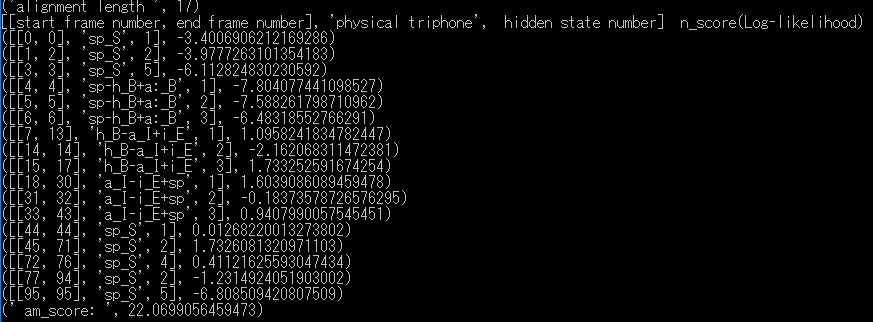
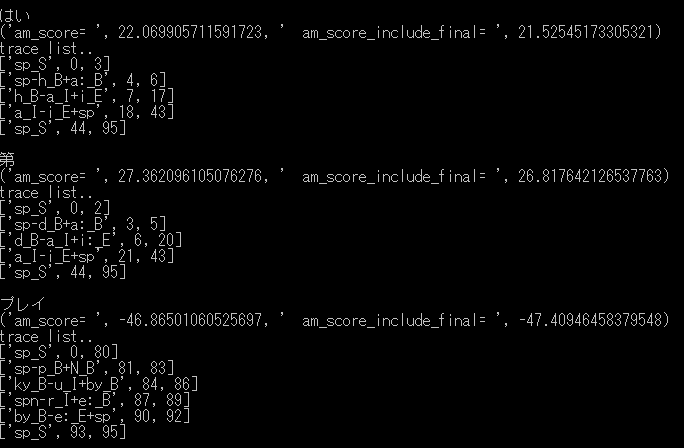

# 音声信号のDNN-HMMの対数尤度の計算

## 概要  

音声認識エンジンJuliusのディクテーションキットに含まれるDNN-HMMモデルを利用して対数尤度を計算するpythonを作ってみた。   
  
## 使い方  
### 1.modelの準備  
Juliusのディクテーションキットversion 4.4をダウンロードする。<http://julius.osdn.jp/index.php?q=dictation-kit.html>  
model/以下を展開する。 

  
### 2.各プログラムの説明  
  
- read_binhmm.py  Juliusのディクテーションキットversion 4.4のDNN-HMM音響モデルを読み込み,HMMモデル,遷移行列,Triphoneとの対応を出力するクラス。
- calcu_likelihood.py　既知の、TriphoneとそのHMMの状態の時系列から対数尤度を計算するクラス。  
  
  
```
python calcu_likelihood.py
```
下記は対数尤度の計算例です。  
  
Juliusの設定で　-salign （認識結果のHMM状態ごとのアラインメント結果を出力）　を利用して TriphoneとそのHMMの状態の時系列を得ることができます。  

  
- calcu_max_likelihood.py Triphoneの時系列から最大対数尤度を計算するクラス。  
```
python calcu_max_likelihood.py
```
下記は最大対数尤度の計算例です。  
  
DNNの出力のサンプルの、「はい」「第」「プレイ」の３個のTriphoneの時系列についての最大対数尤度（am_score=）を計算しています。  
「第」は27.36と高いのですが、Juliusの認識結果は最終的には22.069の単独音の「はい。」と判定されました。  
実際の発話の「プレイ」は、発話区間が無音(sp_S)にアサインされ、-46.86と低い値になっています。  


### 3.各データの説明  
以下のデータは、Juliusディクテーションキットversion 4.4に含まれるデータを利用して作成しています。  
  
- hmm_model_data0.npy　Juliusのディクテーションキットversion 4.4のDNN-HMM音響モデルから作ったHMMモデル(DNNの出力へのインデックス）
- transition_matrix_data0.npy Juliusのディクテーションキットversion 4.4のDNN-HMM音響モデルから作った遷移行列
- dictionary_hmm_trans_hiddenstatenum0.json  Juliusのディクテーションキットversion 4.4のDNN-HMM音響モデルから作った上記とTriphoneとの対応
```
python read_binhmm.py
``` 
で作成できます。   
 
- PLAY-16.wav　音声波形のサンプル。認識結果は「はい。」になっているが、実際には「プレー」と発話している。最後尾の音は処理区間の都合上無視されている。  
- dnn_output_sample0.npy　DNNの出力のサンプル。 Juliusディクテーションキットversion 4.4のDNN(dnnclient)版を利用してDNN出力を取り出したもの。  
  
DNNの出力の求め方については[Wave-DNN](https://github.com/shun60s/Wave-DNN) を参照してください。  

## ライセンス   
以下のライセンス文を参照のこと。   
LICENSE-Julius Dictation Kit.txt  
LICENSE-Julius.txt  


